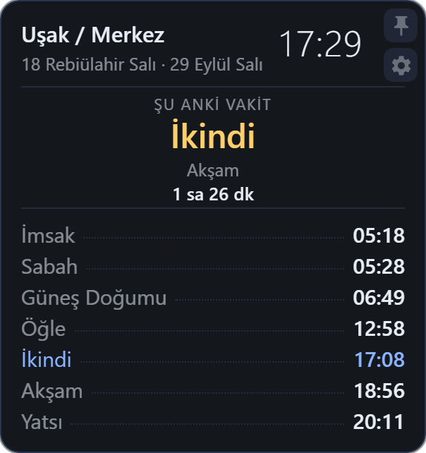
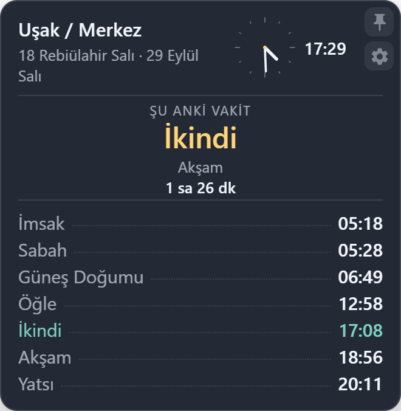
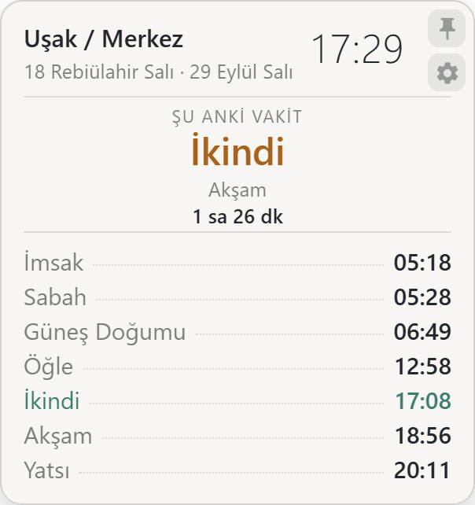

# Namaz Vaktimiz

Masaüstünde yüzen namaz vakti ve saat widget'ı. Saydam, çerçevesiz ve her zaman
görünür; internete bağlı olmadan çalışır.

Tauri v2 + TypeScript + Rust ile yazıldı. Vakitler [adhan](https://github.com/batoulapps/adhan-js)
kütüphanesiyle hesaplanır, varsayılan yöntem **Diyanet**'tir.

---

## Ekran görüntüleri

<div align="center">

| Gece teması · dijital | Cam teması · analog | Nötr tema · dijital |
|:---:|:---:|:---:|
|  |  |  |

</div>

Görüntülerde görülenler: vakit listesi, imsak vakti, kalan süre ve köşedeki
sabitleme / ayarlar düğmeleri.

---

## Özellikler

**Widget**

- Analog ve dijital saat, saniye ve 12/24 saat biçimi seçilebilir
- Şu anki vakit, sıradaki vakit ve ona kalan süre
- İmsak vakti (sabah namazından belirtilen dakika önce)
- Üç pencere modu: **masaüstünde**, **her zaman üstte**, **sadece tepsi**
- Köşede **sabitleme** (pencere yerinde durur, sürüklenmez) ve **ayarlar** düğmeleri
- Yazı boyutu %80–140, saydamlık %35–100 ölçeklenir
- Cam / gece / nötr olmak üzere üç tema
- Pencere konumu kalıcıdır, oturumlar arası korunur

**Konum ve vakitler**

- Türkiye için **81 il / 973 ilçe** çevrimdışı gömülü
- **Dünya modu**: Open-Meteo ile herhangi bir yer aranır, vakitler o
  konumun saat diliminde gösterilir
- Yedi hesaplama yöntemi: Diyanet, Moonsighting, MWL, Mısır, Karaçi, Ümmü'l-Kurâ, Kuveyt
- Mezhep seçimi (Şafi / Hanefi — Asr vaktini etkiler)
- Yüksek enlem kuralı için "Otomatik" ya da sabit seçenek
- Her vakit için ±30 dakika manuel düzeltme
- İsteğe bağlı **Aladhan** ile çevrimiçi doğrulama (yalnız Diyanet yönteminde)

**Davranış**

- Windows açılışında otomatik başlatma
- Tek örnek: ikinci kopyayı açmak widget çoğaltmaz, mevcut öne gelir
- Ayarlar penceresi değişiklikleri widget'a canlı yansıtır
- Kapatma düğmesi pencereyi gizler; çıkış yalnız tepsi menüsünden

---

## Gereksinimler

**Çalıştırmak için**

| | |
|---|---|
| İşletim sistemi | Windows 10 / 11 (x64) |
| WebView2 Runtime | Windows 10 1803 ve üzeriyle birlikte gelir |
| Bellek | Çalışırken ~190 MB (WebView2 taban maliyeti) |
| İnternet | Yalnız dünya modu ve çevrimiçi doğrulama için; vakitler çevrimdışı hesaplanır |

**Kaynaktan derlemek için**

| | |
|---|---|
| Node.js | 20+ (geliştirildiği sürüm: 24.14) |
| Rust | `rust-toolchain.toml` ile sabitlenir: **1.96.1**, hedef `x86_64-pc-windows-msvc` |
| Visual Studio Build Tools | "Desktop development with C++" iş yükü ve Windows SDK |
| Tauri ön koşulları | <https://tauri.app/start/prerequisites/> |

---

## Kurulum

Hazır kurulum dosyasını çalıştırıp gelen sihirbazı tamamlayın. Kurulum
`%LOCALAPPDATA%\Namaz Vaktimiz` altına yazar; Başlat menüsüne ve Masaüstüne
kısayol ekler.

## Kaynaktan derleme

```bash
npm install
npm test
npm run tauri build
```

Üretilen kurulum dosyası:

```
src-tauri/target/release/bundle/nsis/Namaz Vaktimiz_1.0.0_x64-setup.exe
```

`npm run build` yalnız ön yüzü derler (`dist/`), `npm run tauri build` tam
paketi üretir. `tauri.conf.json` hedefi `nsis` olarak sabitlidir.

## Geliştirme

```bash
npm install
npm run tauri dev   # tam uygulama, sıcak yeniden yükleme
npm run dev         # yalnız ön yüz, tarayıcıda 5180 portundan
npm test            # vitest
```

`npm run dev` pencere API'si olmadığı için yalnız ön yüzü gösterir; pencere
boyutlandırma ve sabitleme gibi davranışlar ancak `tauri dev` içinde çalışır.

---

## Vakitler nasıl hesaplanıyor?

Hesaplama [adhan](https://github.com/batoulapps/adhan-js) tarafından yapılır.
`src/prayer.ts` içindeki `makeParams()` ayarlardan parametreleri üretir:

- Yöntem → `CalculationMethod` (varsayılan `Turkey()`, yani Diyanet)
- Mezhep → Asr için `Madhab.Shafi` / `Madhab.Hanafi`
- Yüksek enlem → `HighLatitudeRule.recommended()` (veya kullanıcı seçimi)
- Yuvarlama → `Rounding.Nearest`

Yuvarlamanın "en yakın dakika" olması bilinçlidir: Türkiye yıl boyunca sabit
UTC+03 olduğu için aşağı/yukarı yuvarlama hataları gün içinde birikir.

Gün sınırı konumun saat dilimine göre belirlenir (`zonedNoon`). Dünya modunda
seçilen konumun günü yerel saatle farklıysa bu, vakitlerin yanlış güne
düşmesini engeller.

---

## Veri kaynakları

Türkiye il/ilçe listesi `src/data/turkiye-locations.json` içinde gömülüdür
(81 il, 973 ilçe, saat dilimi `Europe/Istanbul`) ve uygulama çevrimdışı
çalışırken yalnız bu dosyayı kullanır.

| Veri | Kaynak | Lisans |
|---|---|---|
| İlçe koordinatları | [GeoNames TR dökümü](https://download.geonames.org/export/dump/TR.zip) | CC BY 4.0 |
| İl/ilçe adları | [turkiye-il-ilce-mahalle-verileri](https://github.com/adilmustafayilmaz/turkiye-il-ilce-mahalle-verileri) (TurkiyeAPI türevi) | — |
| Dünya modu arama | [Open-Meteo Geocoding](https://open-meteo.com/en/docs/geocoding-api) (`language=tr`) | — |
| Çevrimiçi doğrulama | [Aladhan API](https://aladhan.com/prayer-times-api) | — |

Veri setini yeniden üretmek için (isteğe bağlı, ağ erişimi gerekir):

```bash
npm run data:build
```

> Not: Dünya modunda geocoding isteği `language=tr` ile atılır, bu yüzden
> Lehçe/Yunanca gibi dillerdeki yer adları Türkçe okunuşuyla döner
> (örn. *Kolno / Varmiya-Mazurya Voyvodalığı*).

---

## Proje yapısı

```
index.html            Widget arayüzü
settings.html         Ayarlar penceresi arayüzü
src/
  widget.ts           Widget'ın girişi: mod uygulama, sabitleme, boyutlandırma
  settings-ui.ts      Ayarlar penceresi mantığı
  settings.ts         Varsayılanlar + eski sürüm ayar göçü
  store.ts            Ayar kalıcılığı ve pencereler arası olaylar
  prayer.ts           Vakit hesaplama
  location.ts         Konum çözümleme (il/ilçe + dünya)
  clock.ts            Analog/dijital saat çizimi
  render.ts           Metin ve vakit listesi üretimi
  remote.ts           Aladhan çevrimiçi doğrulama
  themes.ts           Tema değişkenleri
  style.ts            Widget stilleri
  types.ts            Tipler ve mod sabitleri
  data/               Gömülü il/ilçe verisi
tests/                Vitest testleri
tools/                Veri üretim betikleri
src-tauri/
  src/lib.rs          Pencere yönetimi, tepsi ikonu ve menüsü
  capabilities/       İzinler
prompt.docx           Projenin özgün gereksinim dokümanı
```

---

## Bilinen sınırlamalar

- **Yalnız Windows.** Tauri yapılandırması NSIS paketleyicisine ve
  `x86_64-pc-windows-msvc` hedefine sabitlenmiştir.
- **Bellek ~190 MB.** WebView2'nin gömülü taban maliyeti; uygulama kodunu
  değiştirerek anlamlı biçimde düşürülemez.
- **Tepsi tıklaması otomatik testte yok.** Windows tepsi tıklamalarını dışarıya
  iletmediği için "tepsiye sol tıkla → widget geri gelsin" davranışı Vitest'te
  yazılamaz. Elle doğrulandı: sol tık widget'ı geri getiriyor, sağ tık menüsündeki
  *Ayarlar…* ve *Widget'ı gizle* çalışıyor.
- **`package.json` içinde `"private": true`.** Yanlışlıkla npm'e yayınlanmayı
  önler; GitHub için kullanıcı adı yazılıdır.

---

## Lisans

[MIT](LICENSE) © 2026 ilkeryigit

Bu depo, aşağıdaki üçüncü taraf işleri kapsamında dağıtılmaktadır:

- **Material Design ikonları** (pin ve ayarlar düğmesi) — Apache License 2.0.
  Kaynak: [material-design-icons](https://github.com/marella/material-design-icons)
- **GeoNames** Türkiye dökümü — Creative Commons Attribution 4.0
- **adhan**, **Tauri** ve diğer `package.json` bağımlılıkları — kendi
  lisanslarıyla

### Görseller ve ekran görüntüleri

Bu depodaki tüm görseller ve ekran görüntüleri projenin kendi çalışmasıdır:

| Dosya | Kaynak | Lisans |
|---|---|---|
| `src-tauri/icons/*` | Projeye özgü widget ikonu | MIT |
| `docs/screenshots/*.png` | Bu uygulamanın kendi ekran görüntüleri | MIT |
| Köşe düğmelerindeki pin / ayarlar SVG'leri | Material Design (aşağıda) | Apache-2.0 |

`docs/screenshots/` altındaki görüntüler **yalnızca bu uygulamanın ekran
görüntüleridir**; hazır görsel, stok fotoğraf veya üçüncü taraf sanat
içermez. Uygulama arayüzünde görünen Material Design ikonları
[marella/material-design-icons](https://github.com/marella/material-design-icons)
projelidir ve **Apache License 2.0** ile lisanslıdır; bu ikonlar görüntülere
dolaylı olarak yansımış olsa da görüntülerin kendisi MIT ile dağıtılır.
